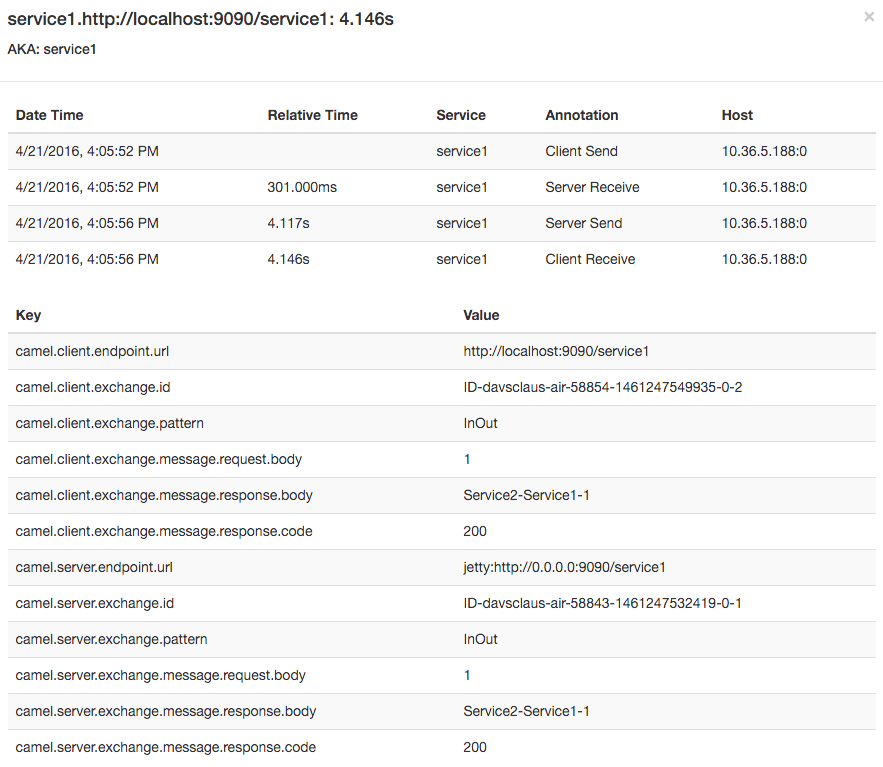

# Zipkin Example

Still work in progress!
Tested using Camel 2.21.

### Introduction

This example shows how to use Camel with Zipkin to trace/timing all incoming and outgoing Camel messages to a Hawkular server.
Its taken from the original Apache Camel 2.21 demo camel-example-zipkin but got modified to send its traces to a Hawkular server.

The example requires a running Hawkular Server and is currently configured for Hawkular to listen for traces on HTTP port 8080.

The example includes three sub maven modules that implement

- client
- service1
- service2

Where client -> service1 -> service2 using HTTP.


Note, service1 is a Spring Boot application and configures camel-zipkin via src/main/resources/application.properties. 
I have not found a way yet to configure the equivalent of 

zipkin.setSpanCollector(HttpSpanCollector.create("http://localhost:8080", new EmptySpanCollectorMetricsHandler()));

in application.properties. 
Further above code has a dependency on mvn:io.zipkin.brave:brave-spancollector-http:3.9.1, which does not seem to work in Spring Boot. Perhaps some other version of this artifact works with Spring Boot, but I have not verified. 
As a result traces from service1 currently do not get displayed properly in Hawkular. 

Note, camel-zipkin versions <2.20 do use the older scribe collector and send their traces in a binary format. 
This is not understood by Hawkular (at least not out of the box), so one needs to use camel-zipkin 2.20 or higher in order to use the newer HTTP collector.

### Configuration

This example assumes you will run Zipkin on the same host using the default collector port of 9410.  If you wish to change those, you can do so using these files:  

Service1 is configured in the `src/main/resources/application.properties` properties file.
Service2 is configured in the `src/main/java/sample/camel/Service2Route.java` source file.
Client is configured in the `src/main/java/sample/camel/ClientApplication.java` source file.

### Build

First, start Zipkin as described below in the [Installing Hawkular Server]("Installing Hawkular Server") section

Then compile this example:

```sh
$ mvn compile
```

### Run the example

Then using three different shells and run service1 and service2 before the client.

```sh
$ cd service1
$ mvn compile spring-boot:run
```

When service1 is ready then start service2

```sh
$ cd service2
$ mvn compile camel:run
```

And then start the client that calls service1 every 30th seconds.

```sh
$ cd client
$ mvn compile camel:run
```

### Zipkin UI

You should be able to visualize the traces and timings from this example using the Zipkin UI.
The services are named `service1` and `service2`.

In the screen shot below we are showing a trace of a client calling service1 and service2.


You can then click on each span and get annotated data from the Camel exchange and about the requests as shown:




### Installing Hawkular Server

A fairly quick way to get up and running on Hawkular is pulling and running an appropriate docker container.

```bash
docker run -p 8080:8080 jboss/hawkular-apm-server-dev


### Installing Zipkin Server 

The quickest way to get Zipkin started is to fetch the [latest released server](https://search.maven.org/remote_content?g=io.zipkin.java&a=zipkin-server&v=LATEST&c=exec) as a self-contained executable jar.

```bash
curl -sSL https://zipkin.io/quickstart.sh | bash -s
```

.. and then run it

```bash
java -jar zipkin.jar
```

Finally, browse to http://localhost:9411 to find traces!

### Installing Zipkin Server using Docker

If you want to try Zipkin locally then you quickly try that using Docker.

There is a [quickstart guide at zipkin](http://zipkin.io/pages/quickstart.html) that has further instructions.
Remember to configure the IP address and port number in the `application.properties` file.

You can find the IP using `docker-machine ls`

### Forum, Help, etc

If you hit an problems please let us know on the Camel Forums
<http://camel.apache.org/discussion-forums.html>

Please help us make Apache Camel better - we appreciate any feedback you may
have. Enjoy!

The Camel riders!
